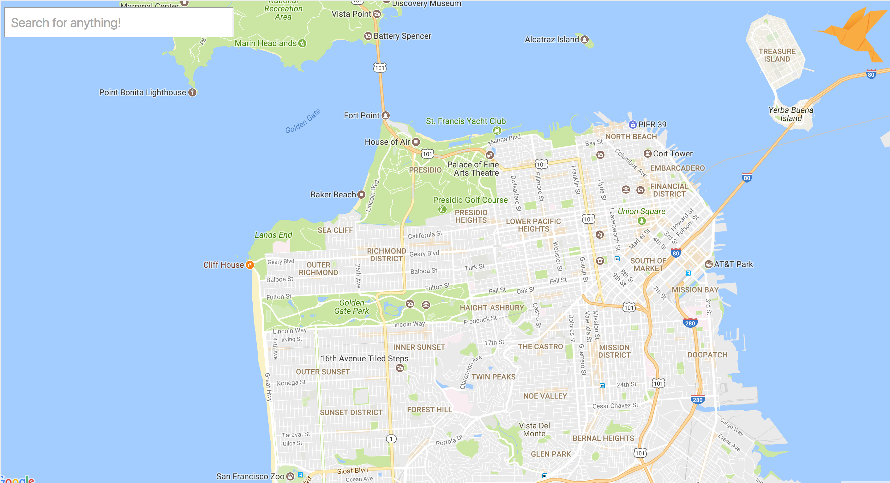
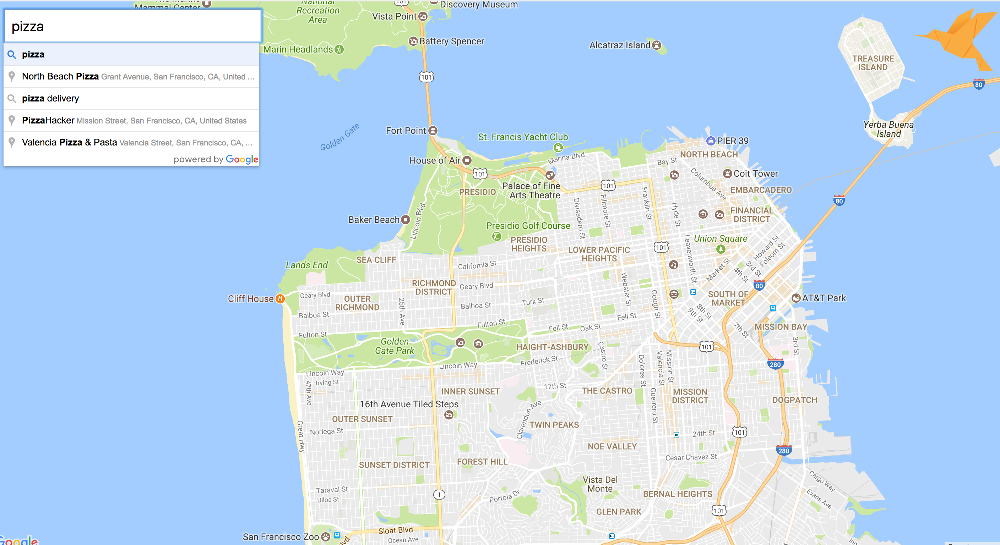
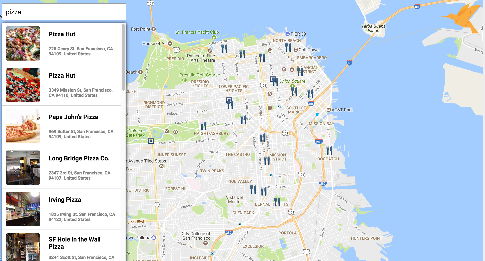
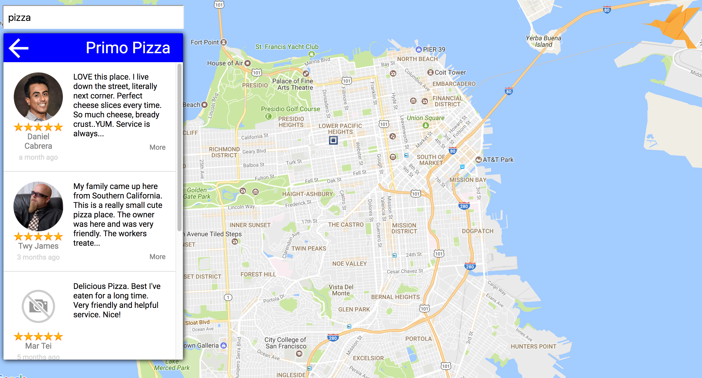
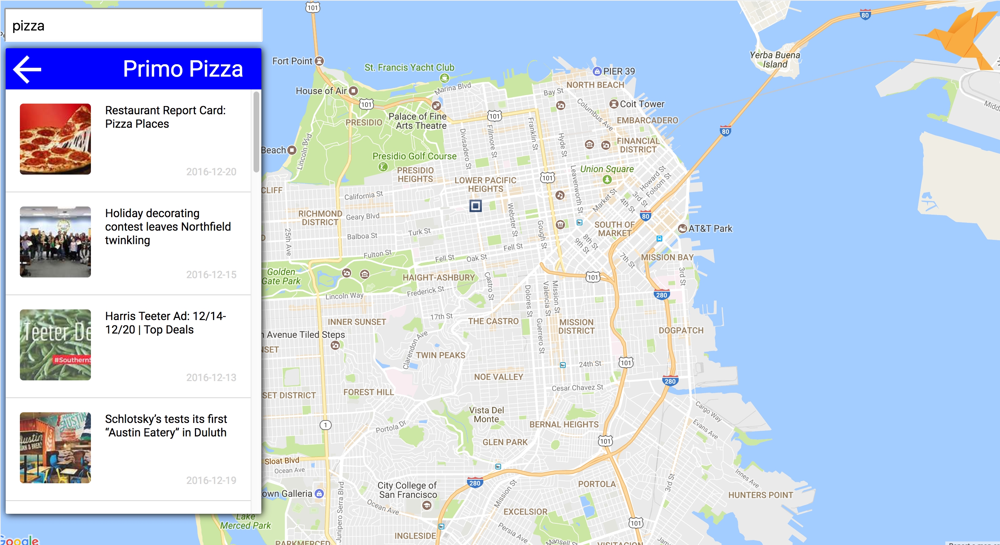
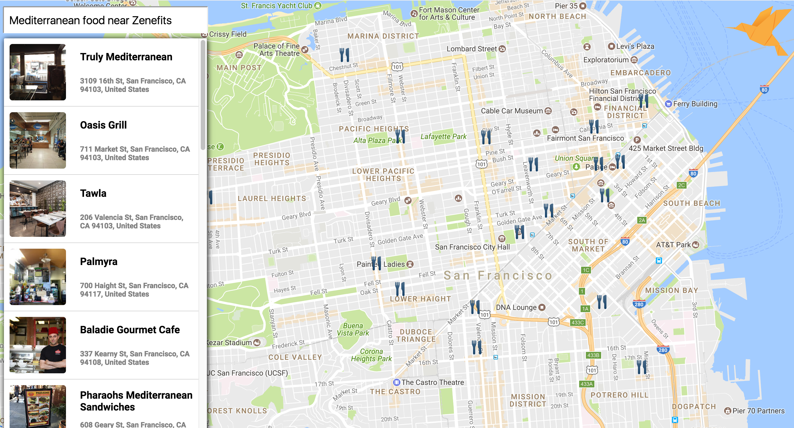

## Zenefits Coding Challenge

I used the Google Places API in connection with the Bing News API and React to create an interactive location search front end.

[Live][url]
[url]: https://michaeljstevens.github.io/zenefits/


### Features

- Uses geolocation to center map on user's current location
- Integrates with both the Google Places API and Bing News API
- Features location-based review and news pages
- Interactive markers that bounce and filtered results based on the viewport

### Architecture and Technologies

- JavaScript
- React
- jQuery(Ajax)
- CSS3/HTML5

### Instructions

- ```npm install```
- ```webpack```
- Open index.html in browser (or serve via node with ```http-server```)

### How it Works

### Screenshots
<div style='display: flex; width: 560px; flex-wrap: wrap; justify-content: space-between'>
  
  
  
  
  
  
</div>
